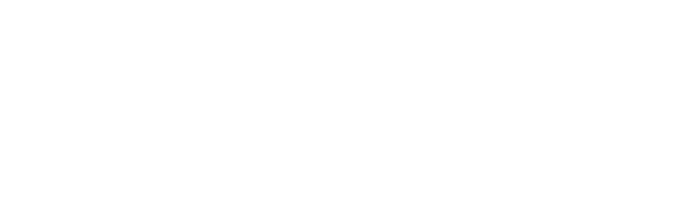
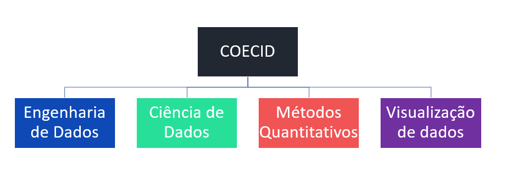
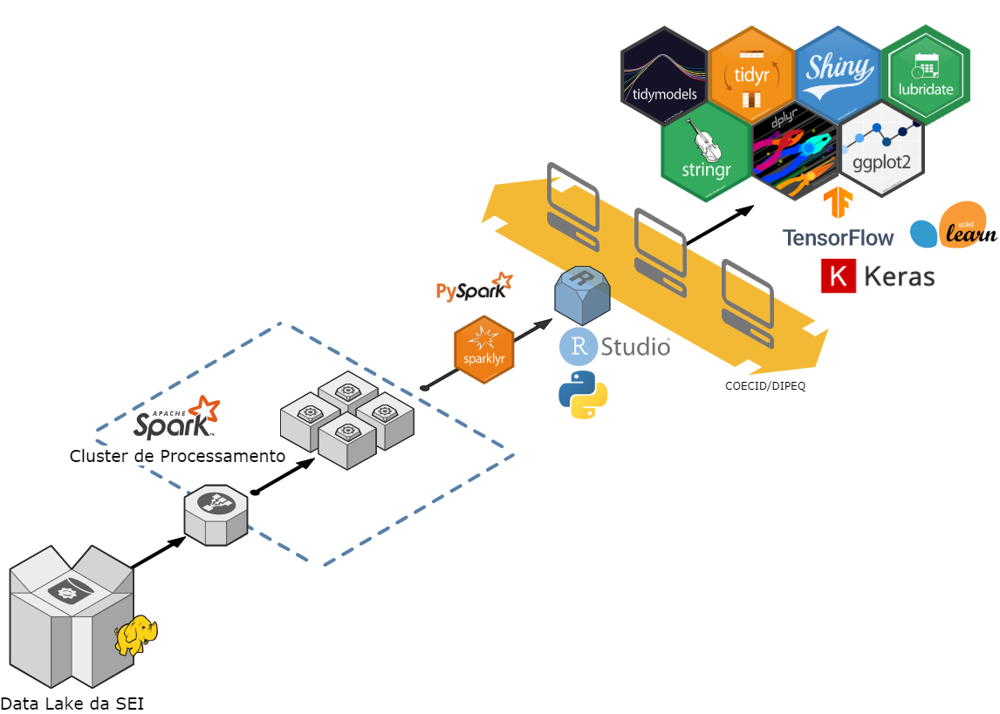
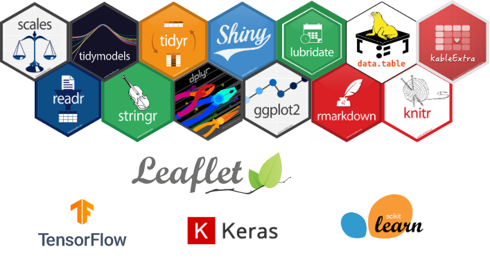
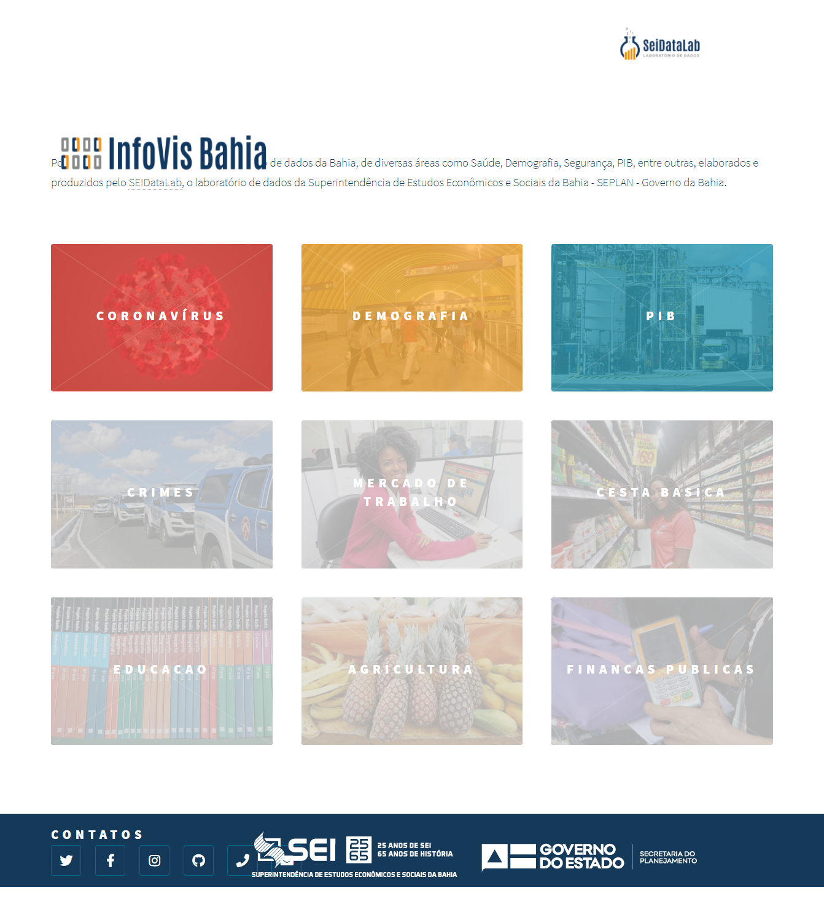
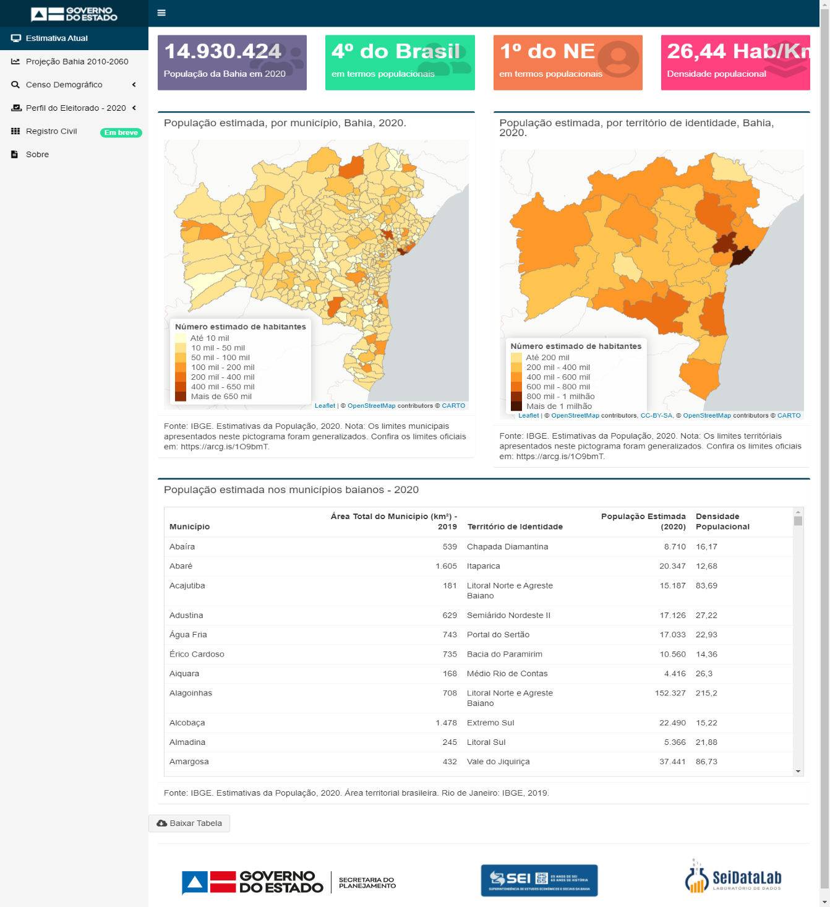
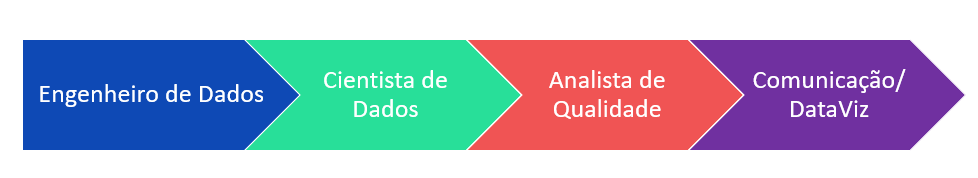
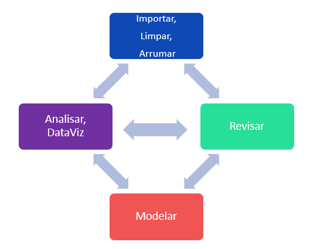

layout: true

<div class="my-footer">



</div>

---

## Coordenação de Engenharia e Ciência de Dados em Pesquisa

<div style="text-align: justify">

Regimento da SEI:

- Executar métodos quantitativos e computacionais para sistematização de dados oriundos de pesquisas e registros administrativos para a elaboração de indicadores, estimativas e projeções que viabilizem estudos e análises demográficas e socioeconômicas com foco no comportamento das condições de vida da população no Estado da Bahia e dos seus municípios;

- Operacionalizar o desenvolvimento de técnicas avançadas de Ciência de Dados: inteligência artificial, aprendizagem de máquina e modelagem estatística; e estratégias empíricas de apoio à formação, implementação, gestão e avaliação de políticas públicas;

---

## Coordenação de Engenharia e Ciência de Dados em Pesquisa

<div style="text-align: justify">

Regimento da SEI:

- Gerir o repositório de dados brutos (Data Lake) da SEI, onde serão hospedadas as bases de dados massivas em termos de volume, variedade e velocidade (Big Data);

- Operar e monitorar, através de sistemas de computação distribuída, o processamento paralelo de bases de dados massivas, em termos de volume, variedade e velocidade (Big Data), mediante articulação com as demais coordenações da Autarquia, de forma que viabilize a implementação de métodos quantitativos e computacionais relevantes para manipulação e sistematização dessas bases de dados e visualização de padrões de dados contidas nelas;

- Gerir e coordenar a plataforma de visualização de dados da SEI, para disseminação de informações e estatísticas socioeconômicas do Estado da Bahia.


---

## Pilares da **"Coecid"**


```{r echo=FALSE, out.width='100%', fig.align="center", fig.cap="Pilares da Coordenação" }

```

---

## Engenharia de Dados:

- Processamento Paralelo (**cluster de processamento**);
- Gestão do DataLake (repositório de **Big Data**)

---

## Engenharia de Dados:

- Processamento Paralelo (**cluster de processamento**);
- Gestão do DataLake (repositório de **Big Data**)

```{r echo=FALSE, out.width='75%', fig.align="center", fig.cap="" }

```

---

## Ciência de Dados e Métodos Quantitativos:

- **Inteligência Artificial, Machine Learning e Modelagem Estatística**:
  - Classificação, agrupamento, regressão, etc.;
  - Mineração de dados, econometria, etc.;
- Análise e manipulação de dados:
  - Pesquisas primárias, microdados, registros administrativos, etc.;
- Estimativas e Projeções (**Demografia Formal**);
- Avaliação de Políticas Públicas.

---

## Ciência de Dados e Métodos Quantitativos:

- **Inteligência Artificial, Machine Learning e Modelagem Estatística**:
  - Classificação, agrupamento, regressão, etc.;
  - Mineração de dados, econometria, etc.;
- Análise e manipulação de dados:
  - Pesquisas primárias, microdados, registros administrativos, etc.;
- Estimativas e Projeções (**Demografia Formal**);
- Avaliação de Políticas Públicas.

```{r echo=FALSE, out.width='60%', fig.align="center", fig.cap="" }

```

---

## Visualização de Dados (**DataViz**):

- Gestão do **InfoVis**;
- Construção de painéis dinâmicos (**R Shiny**)


---

## Visualização de Dados (**DataViz**):

- Gestão do **InfoVis**;
- Construção de painéis dinâmicos (**R Shiny**)


```{r echo=FALSE, out.width='50%', fig.show ='hold', fig.cap="" }


```

---

## Competências Necessárias

- Curiosidade;
- Vontade de aprender;
- Linguagem de programação: R/Python/SQL
- Controle de versionamento: Git/GitHub;
- Conceitos (conhecimento teórico):
  - Big Data, Processamento Paralelo (cluster), Inteligência Artificial, Machine Learning
- Aplicação (conhecimento prático) - R:
  - Tidyverse:

```{r eval=FALSE}
library(tidyr)
library(dplyr)
library(stringr)
library(ggplot2)

# Dominar as funções:
filter()
group_by()
summarise()
mutate()
```

---

## Fluxo de trabalho

Fluxo Desejado - **Futuro**:

```{r echo = FALSE, fig.align='center', fig.show ='hold'}

```

---

## Fluxo de trabalho

Fluxo Esperado - **Atual**:

```{r echo = FALSE, fig.align='center', out.width='70%'}

```

---

## Próximos Projetos (Curto-Médio Prazo)

**Em andamento:**

- Painel do Observatório de CT&I – InfoVis (parceria com a Secti);
- Subsídios para a construção do índice de reajuste de contrato de licitação – Leitura e manipulação das NFe em R – Parceria com a Sefaz e Saeb;

**Curto Prazo:** 

- Operacionalização do cluster de processamento – Parceria com Coinf;
- Auxílio do ajuste do PPC e IPC – Parceria com Copese;
- Painel sobre a pesquisa de satisfação da Rede SAC – Parceria com Copese;

**Médio Prazo:**

- Projeto NF-e - Auxiliar no desenvolvimento dos Produtos esperados:
  - Custo de vida;
  - Acompanhamento do consumo de medicamentos;
  - Impacto de Eventos e Empreendimentos.

